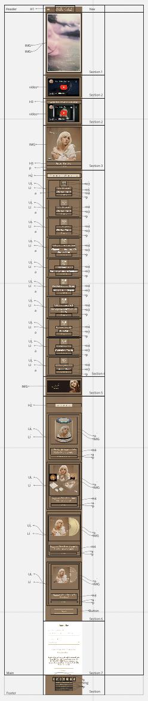
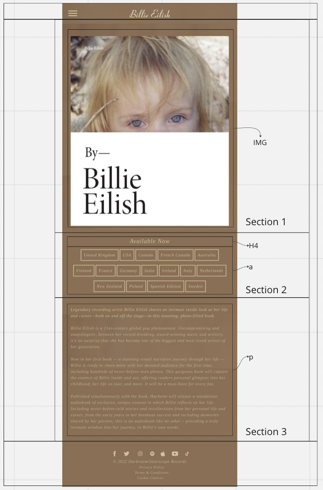

# Procesverslag
Markdown is een simpele manier om HTML te schrijven.  
Markdown cheat cheet: [Hulp bij het schrijven van Markdown](https://github.com/adam-p/markdown-here/wiki/Markdown-Cheatsheet).

Nb. De standaardstructuur en de spartaanse opmaak van de README.md zijn helemaal prima. Het gaat om de inhoud van je procesverslag. Besteedt de tijd voor pracht en praal aan je website.

Nb. Door *open* toe te voegen aan een *details* element kun je deze standaard open zetten. Fijn om dat steeds voor de relevante stuk(ken) te doen.

## Jij

  
uitwerken voor kick-off werkgroep

  ### Auteur:
  Julia Meijer

  #### Je startniveau:
  Blauw

  #### Je focus:
  Surface plane
 

## Je website

  
uitwerken voor kick-off werkgroep

  ### Je opdracht:
  Het namaken van de Billie Eilish website door middel van HtML, CSS en Javascript. 
  https://www.billieeilish.com/ 

  #### Screenshot(s) van de eerste pagina (small screen): 
  Billie Eilisch Homepagina
  

  #### Screenshot(s) van de tweede pagina (small screen):
  Billie Eilish Book pagina
  

## Toegankelijkheidstest 1/2 (week 1)

  
uitwerken na test in 1e werkgroep

  ### Bevindingen
  Lijst met bevindingen die naar voren kwam:

  #### Screenreader
  Wanneer ik probeer te navigeren door de Billie Eilish website met de screenreader, begint de screenreader met lezen van het allereerste 
  element in de linker bovenhoek. Als ik op tab klik om naar het volgende element te gaan, dan werkt dit niet heel goed en gaat de 
  screenreader verder met voorlezen op volgorde. 
  
  De Billie Eilish website is dus niet heel toegankelijk, aangezien voor veel mensen de eerste linkse elementen van de pagina 
  helemaal niet relevant zijn maar ze wel moeten wachten totdat de screenreader bij het gewenste element is. 

  #### Muis en Toetsenbord 
  De muis verandert van vorm wanneer je over bijvoorbeeld een afbeelding of knop gaat. Dit geeft aan dat het een klikbaar object is. Als je met de muis over het menu gaat, dan verandert deze van kleur en laat dus zien dat de muis is geland op dat menu item, dit is heel goed voor de toegankelijkheid

  Als je probeert te tabben zonder de screenreader aan, dan gaat hij elk individueel element af (echt elke zin etc). Dus het lijkt 
  alsof de tab op een gegeven moment niks meer doet, maar dan is hij bezig met langs de zinnen te gaan. Het is dus mogelijk om zonder 
  de scrollen door de pagina te komen. Dus is goed voor de toegankelijkheid, aangezien sommige mensen misschien niet in staat zijn
  om de scrollbeweging te maken.  
  Met de spatie gaat het beweging door de pagina een stuk gemakkelijker, nu spring je door de pagina heen zonder op de elementen op de
  website te letten. 

  
  #### Motoriek (shocks, elastiekjes)
  We hebben in de eerste week niet een toegankelijkheidstest gedaan met de motoriek. 

  #### Visueel (brillen, contrast, kleurenblind, dark/light). 
  We hebben in de eerste week niet met de brillen, contrast of kleurenbindheid getest. Wel heb ik uitgetest of er een dark/light mode
  op deze site is toegepast, maar dit is niet het geval. 
  Hier zou ik eventueel mij op kunnen focussen, omdat dit veel toevoegd aan de toegankelijkheid van de site.

## Breakdownschets (week 1)

  
uitwerken na afloop 2e werkgroep

  ### de hele pagina: 
  

  ### dynamisch deel (bijv menu): 
  

## Voortgang 1 (week 2)

  
uitwerken voor 1e voortgang

  ### Stand van zaken
  hier dit ging goed & dit was lastig (neem ook screenshots op van delen van je website en code)

  ### Agenda voor meeting
  samen met je groepje opstellen

  | Sashsa         | Sterre             | Julia Meijer    
  | ---            | ---                | ---         
  | dit bespreken  | en dit             | Waarom lukt het niet om mijn menu animatie te maken?   
  | en dat ook nog | dit als er tijd is | Hoe moet ik een lyrics video van Billie Eilish toevoegen? 
  | ...            | ...                |          

  ### Verslag van meeting
  hier na afloop snel de uitkomsten van de meeting vastleggen

  - Kelly Mae heeft een website doorgestuurd waardoor het wel lukt om een Billie Eilish video toe te voegen. 
    -> Youtube video's van artiestsen mogen blijkbaar niet zomaar op andere sites gebruikt worden. 

## Voortgang 2 (week 3)

  
uitwerken voor 2e voortgang

  ### Stand van zaken
  Bij deze feedback les heeft iedereen zijn website op het grote scherm laten zien en gaf de docent feedback. Hierbij heb ik vooral vragen gesteld
  over dingen die nog niet helemaal lukten, zoals het menu naar links laten sliden.
  Ook hebben we hierbij vastgesteld welke dingen ik van de surfaceplane uit ga werken; 
  - Menu tab baar maken (slide van rechts naar links)
  - Dark Mode
  - Button Hover
  - Fixed Header
  - Toegankelijkheid+ ( in het menu aangeven waar de gebruiker zich bevind op de pagina )

  ### Verslag van meeting
  Ik vond het heel nuttig om met de docent naar mijn werk te kijken en hierbij feedback te krijgen. Hierdoor had ik weer op een rijtje wat er nog moet gebeuren
  en hoe ik dit uit zou gaan moeten werken. 

## Toegankelijkheidstest 2/2 (week 4)

  
uitwerken na test in 8e werkgroep

  ### Bevindingen
  Lijst met je bevindingen die in de test naar voren kwamen (geef ook aan wat er verbeterd is):

  #### Screenreader
  Door met een tweede keer door de pagina te gaan met de screenreader kwam ik erachter dat het niet gemakkelijk is voor een screenreader-gebruiker 
  om een video te bekijken. De screenreader ging als eerst alle elementen om de video heen lezen zoals; de titel, ondertitel en zelf het youtube logo werd
  voorgelezen. Dit is niet heel toegankelijk, aangezien de gebruiker hoogstwaarschijnlijk niet geinteresseerd hierin is en gewoon de video wilt bekijken. 

  Dit kan opgelost worden door de gebruiker de mogelijkheid te geven om sneller door de kopjes heen te tabben en niet verplicht te worden om alle tekst aan te horen. 

  #### Muis en Toetsenbord 
  Ik heb niet meer bevindingen gedaan door een tweede keer door de pagina te gaan.

  #### Motoriek (shocks, elastiekjes)
  Tijdens de test hebben we een toegankelijkheidstest met shocks, elastikjes en ballonnen gedaan. 
  De shocks zijn voor mensen met bijvoorbeeld een ziekte zoals Parinson die hun spieren niet zo kunnen bewegen zoals zij willen. Door deze test kwamen we erachter of het mogelijk is voor iemand met zo'n soort ziekte om door de pagina te navigeren. Naar mijn ervaring ging het navigeren best goed, het gaat natuurlijk wel iets minder gemakkelijk dan voorheen maar over het algemeen lukte het. Nu denk ik wel dat ik een lage stand had aangezet en als je een echte ziekte hebt die je spieren beinvloedt, dat het misschien lastiger wordt. 

  

  De elastiekjes zijn voor mensen met een fysieke handicap, de elastiekjes op de foto zijn voor mensen waarbij 2 vinger aan elkaar gegroeid zijn. Vanuit mijn ervaring met de test is het voor een fysiek gehandicapt persoon (tot zekere hoogte) mogelijk om deze site te gebruiken. 

  
  De ballonnen zijn voor gebruikers met een concentratie probleem. Ik kwam er tijdens de tests achter dat ik persoonlijk niet afgeleid werd door de ballonnen, en ik de site zoals gewoonlijk kon door
  navigeren. Dit komt denk ik mede doordat de site niet heel moeilijk te navigeren is, en hiervoor dus ook niet volle concentratie nodig is. 

  Mijn uiteindelijke conclusie uit deze test is; het is mogelijk voor iemand met een handicap om deze site te gebruiken, als de handicap erger wordt kan het wat lastiger worden. 

  #### Visueel (brillen, contrast, kleurenblind, dark/light). 
  

  Tijdens deze test was het de bedoeling om de site te gebruiken met een visuele aandoening. Ik heb alle brillen met de verschillende ziektes uitgeprobeerd. De site van Billie Eilish is wat eenkleurig, dus dit was een klein obstakel tijdens het doen van deze tests. Maar over het algmeen zou ik zeggen dat het zeker mogelijk en toegankelijk is om deze site te gebruiken voor iemnand met een visuele aandoening. 

## Voortgang 3 (week 4)

  
uitwerken voor 3e voortgang

  ### Stand van zaken
  Tijdens deze voortgang hebben we de site op het grote scherm laten zien voor de docent. Hier kregen we feedback op de tot nu toe gemaakte site. 

  Mijn feedback was vooral dat ik de elementen die er nog niet waren af moest maken voor de deadline. Voor de rest lijkt de site op de originele Billie Eilish site. 
  Ook kon ik nog vragen stellen over dingen die ik lastig vond en niet helemaal lukte zoals; de tekst over de hele pagina centreren. 

  ### Verslag van meeting
  Het was erg nuttig om mijn eindproduct nog een keer voor te leggen aan de docent en hier feedback op te krijgen. Op deze manier weet je gelijk of je de goede kant op gaat en wat er nog gedaan moet worden. 

## Eindgesprek (week 5)

  
uitwerken voor eindgesprek

  ### Je uitkomst - karakteristiek screenshots:
  

  ### Dit ging goed/Heb ik geleerd: 
  Korte omschrijving met plaatjes

  

  ### Dit was lastig/Is niet gelukt:
  Korte omschrijving met plaatjes

  

## Bronnenlijst

  
continu bijhouden terwijl je werkt

  Nb. Wees specifiek ('css-tricks' als bron is bijv. niet specifiek genoeg).

  1. Bahaa Salaymeh (student)
  2. Robbert Spier (docent)
  3. Berry Nieskens (docent)
  4. State toevoegen aan buttons https://www.w3schools.com 
  5. Hele menu + slide https://codepen.io/your-work/ 
  6. Alles positioneren met flexbox https://codepen.io/shooft/pen/dymmLGG 
  7. Google fonts toevoegen https://dlo.mijnhva.nl/content/enforced/437099-FDMCI-2000FED121-DMCI-CMD-2223-1/FED%2022-23%20-%20Blok%202%20-%20Oefening%20typografie.pdf 

